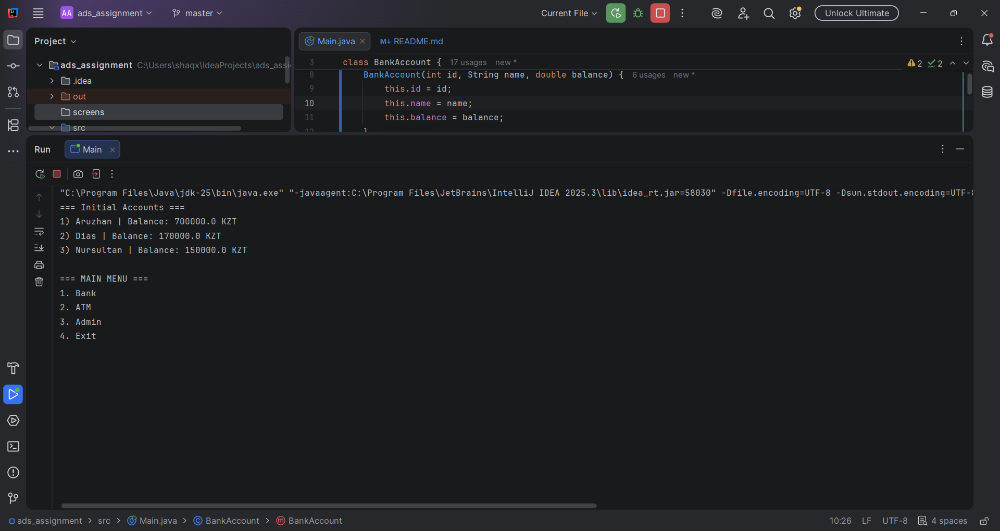
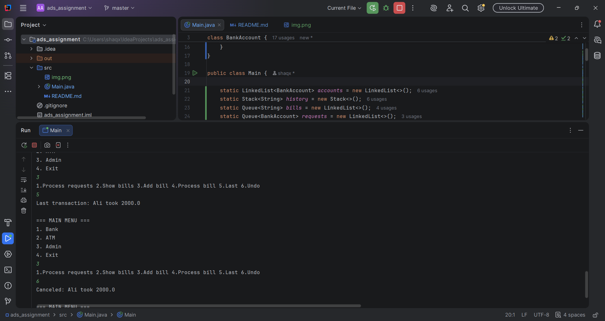
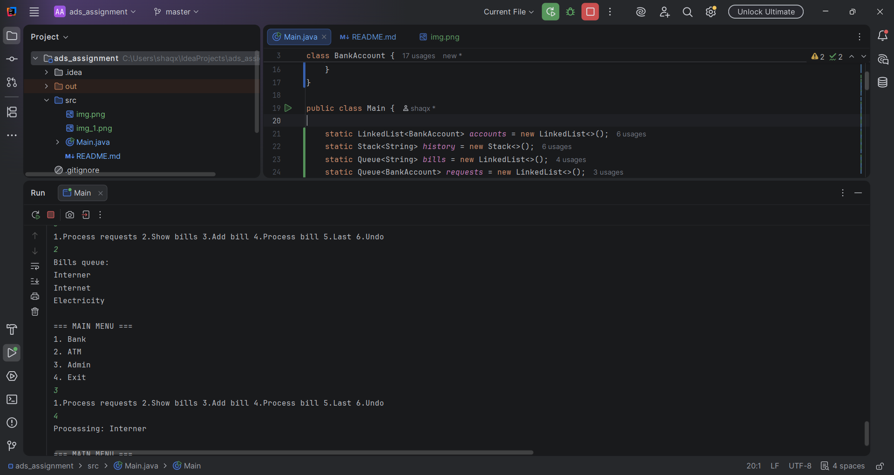
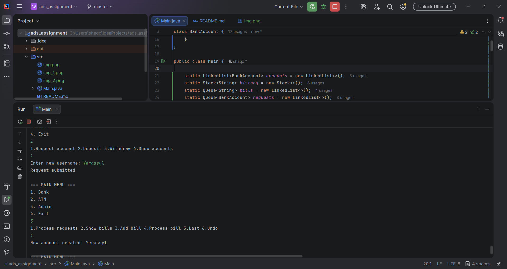
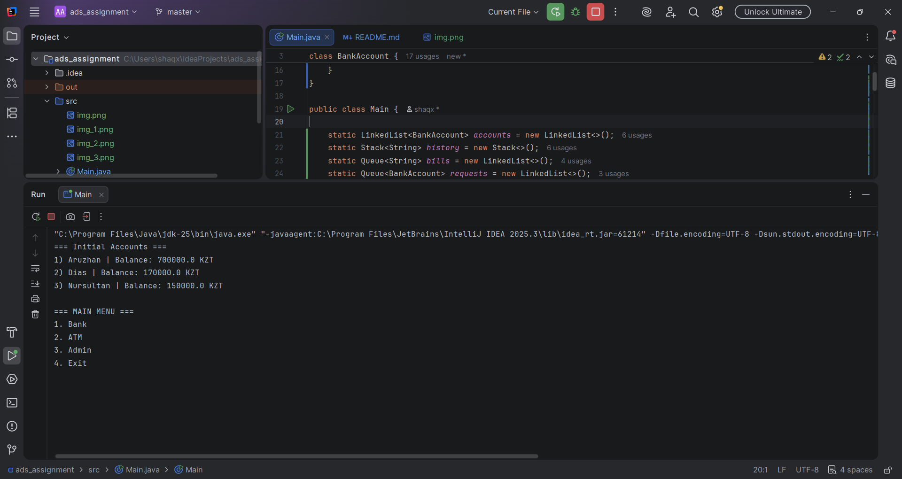

# Assignment 2: Physical & Logical Data Structures (Banking System)

**Student:** Altynbayev Yerassyl  
**Group:** IT-2504

##  Objective
The primary goal of this project is to implement a simulated mini-banking system utilizing various Java data structures. This assignment demonstrates the practical differences and use cases between physical data structures (Arrays) and logical data structures (LinkedList, Stack, Queue).

##  Data Structures Implemented
* **LinkedList (`accounts`)**: Serves as the main database for storing bank accounts. It allows for dynamic resizing and efficient management as new clients are added to the system.
* **Stack (`transactionHistory`)**: Implements **LIFO** (Last-In, First-Out) for logging transaction actions (deposits, withdrawals, bills). This structure allows the system to easily "Undo" the most recent financial action.
* **Queue (`accountRequests`)**: Manages new account opening requests using the **FIFO** (First-In, First-Out) principle, ensuring fair sequential processing by the administrator.
* **Queue (`billQueue`)**: Handles utility bill payment requests in the exact order they were submitted.
* **Array**: Utilized for the physical storage of predefined bank accounts before integrating them into the broader logical systems.

---

## Program Execution & Task Screenshots
*(Screenshots demonstrating the functionality of each required task)*

### Part 1: Logical Data Structures

**Task 1: Bank Account Storage Using LinkedList**
*Functionality: Added new accounts, displayed all accounts, and searched by username.*
> 

**Task 2: Deposit & Withdraw Operations**
*Functionality: Successfully updated balances inside the LinkedList upon deposit and withdrawal.*
> 

**Task 3: Transaction History (Stack LIFO)**
*Functionality: Added transactions, displayed the last action (peek), and reverted the last action (pop).*
> 

**Task 4: Bill Payment Queue (Queue FIFO)**
*Functionality: Added and processed bill payment requests in sequential order.*
> 

**Task 5: Account Opening Queue (Admin Simulation)**
*Functionality: Submitted user requests and processed them into the main LinkedList.*
> 

### Part 2: Physical Data Structures

**Task 6: Array Implementation**
*Functionality: Created an array `BankAccount[3]`, stored predefined accounts, and printed them.*
> 

### Part 3: Mini Banking Menu Integration

**Bank, ATM, and Admin Menus**
*Functionality: Integrated all tasks into a single interactive console menu.*
> 

---

## Summary of Work Process
1. **Project Setup**: Designed the `BankAccount` class to encapsulate essential client data, including `accountNumber`, `username`, and `balance`.
2. **Core Implementation**:
    * Linked the `Stack` to every deposit and withdrawal method to accurately support the "Undo" feature required in Task 3.
    * Utilized `Collections.addAll` to efficiently migrate predefined physical array data into the dynamic `LinkedList`.
    * Designed the interactive console menu to properly route the user to Bank, ATM, or Admin functionalities.
3. **Testing & Validation**: Verified that all logical queues behaved strictly according to FIFO and stacks according to LIFO. Ensured that the application runs without errors as per submission requirements.
4. **Issues Encountered & Solutions**: A significant issue arose with Java's `Scanner` class skipping `String` inputs (like usernames) immediately after reading integers with `nextInt()`. I resolved this by inserting a `nextLine()` buffer clear after numerical inputs to properly consume the leftover newline character.