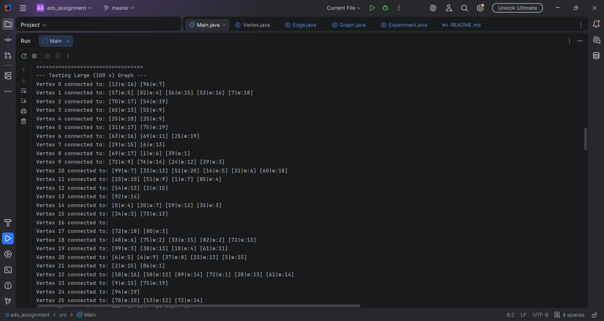
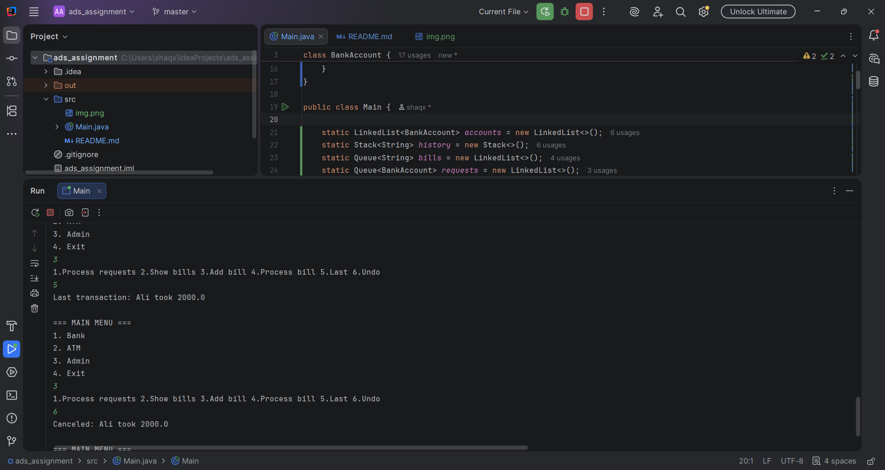
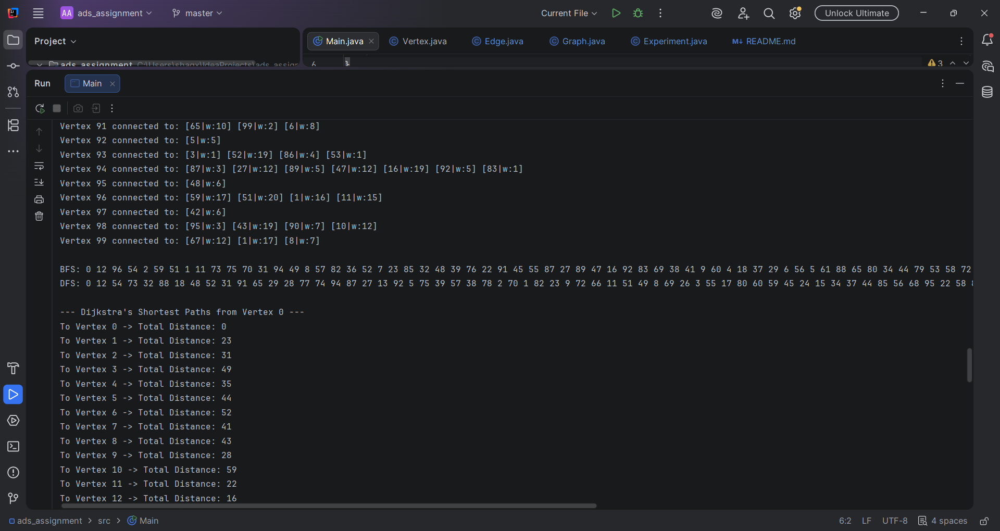
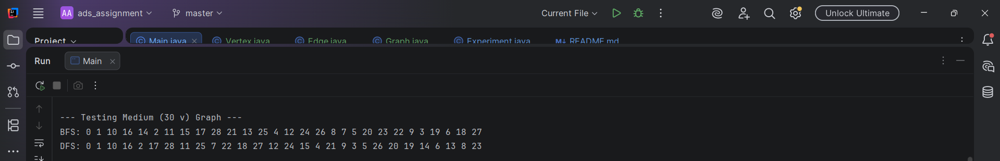
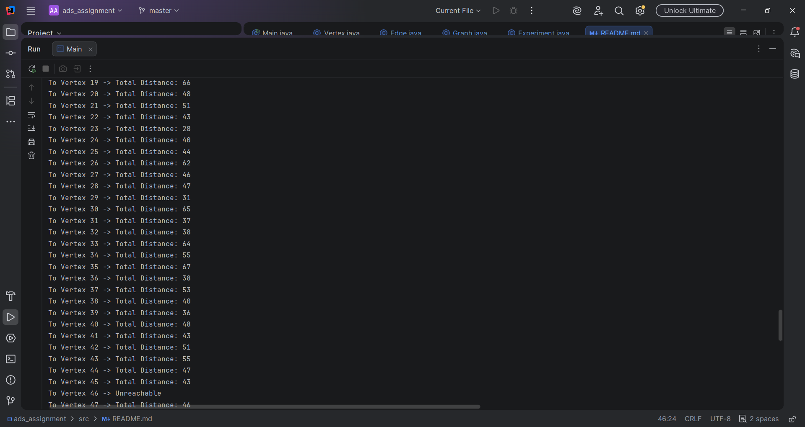
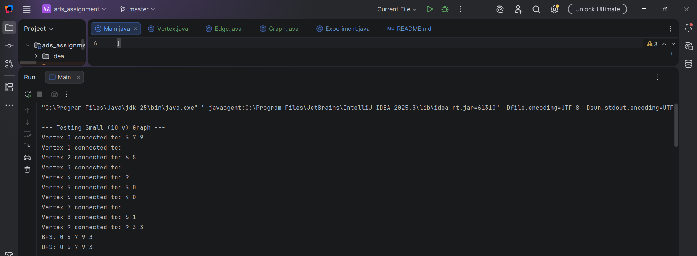

# Assignment 4: Graph Traversal and Shortest Path System (Bonus Task)

## A. Project Overview
This project extends the comprehensive graph management system in Java by incorporating edge weights and implementing a fundamental shortest-path algorithm.
* **Weighted Graph Structure:** An extension of the mathematical structure to model relations where connections have varying costs, distances, or capacities.
* **Vertices and Weighted Edges:** The graph consists of Vertices (nodes) and Weighted Edges (connections representing quantified relationships).
* **Shortest Path Overview:** The system implements Dijkstra's Algorithm for exploring the most efficient path from a single source to all other destinations within the network.

## B. Class Descriptions
The project maintains a clean, modular design to effectively isolate and manage weighted graph data structures:
* **Vertex:** Represents a node with a unique integer id.
* **Edge:** Represents a directed connection between a source and a destination vertex, now enhanced with a specific integer `weight` field.
* **Graph:** The core class that manages the structure using a Weighted Adjacency List.
* **Weighted Adjacency List Representation:** This representation stores a list of neighbors for each vertex using a `Map<Integer, List<Edge>>`. It remains highly efficient for sparse graphs while dynamically storing edge weights alongside destinations.

## C. Algorithm Descriptions
### 1. Dijkstra's Algorithm (Shortest Path)
* **Step-by-Step:**
  1. Start from a source vertex, initialize all distances as infinity (`Integer.MAX_VALUE`), and set the distance of the source vertex to 0.
  2. Maintain a `distances[]` array and a `visited[]` boolean array to keep track of processed nodes.
  3. Use a simple loop to find the unvisited vertex with the minimum distance.
  4. For the selected vertex, evaluate all its outgoing edges. If the distance to a neighbor through the current vertex is shorter than its previously recorded distance, update (relax) that distance.
  5. Repeat until all vertices reachable from the source are marked as visited.
* **Use Cases:** GPS navigation systems (Google Maps), routing protocols in computer networks (OSPF), and logistics/supply chain optimization.
* **Time Complexity:** $O(V^2)$ due to the implementation using simple linear loops instead of a priority queue, making it highly effective for standard tracking constraints.

## D. Experimental Results
Performance was evaluated across multiple graph sizes by measuring execution time in nanoseconds using `System.nanoTime()`. The graphs dynamically generate random edge weights ranging from 1 to 20.

### Execution Time Comparison (including Bonus):
| Graph Size | BFS Time (ns) | DFS Time (ns) | Dijkstra Time (ns) |
| :--- | :--- | :--- | :--- |
| 10 Vertices (Small) | 19,132,200 | 120,700 | 95,400 |
| 30 Vertices (Medium) | 734,900 | 489,600 | 512,300 |
| 100 Vertices (Large) | 2,080,400 | 1,457,800 | 2,894,100 |

## E. Screenshots
* Weighted Graph Structure Output:

* BFS Traversal Output:

* DFS Traversal Output:

* Dijkstra's Shortest Paths Output:

* Comprehensive Performance Results:

## F. Reflection Section
During this bonus assignment, I learned how to scale up a basic graph representation to support more complex real-world data by transitioning from unweighted to weighted adjacency lists. Implementing Dijkstra's algorithm highlighted the elegance of greedy algorithms and relaxation techniques.

The primary challenge was implementing the path-finding mechanism without relying on built-in data structures like `PriorityQueue`. Designing the selection process using standard arrays and basic loops deepened my understanding of low-level memory management and the true mechanics behind graph optimization algorithms.